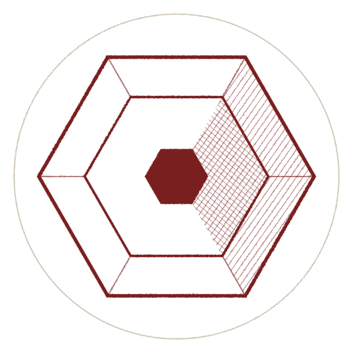

<picture>
  <source media="(prefers-color-scheme: dark)" srcset="./assets/cirwel-device-dark.svg">
  
</picture>

## CIRWEL

**Infrastructure for long-lived AI agents.**

CIRWEL builds systems for agent work that spans sessions, restarts, and handoffs.

The main project is **[UNITARES](https://github.com/cirwel/unitares)**, a self-hosted runtime layer that keeps identity, evidence, memory, runtime state, review, and coordination accountable across those boundaries.

*Long-lived* describes continuity of the work and its accountable record, not a claim that one process runs forever.

UNITARES runs alongside model providers and agent frameworks rather than replacing them.

### Start here

**[UNITARES](https://github.com/cirwel/unitares)**  
Infrastructure for long-lived agents. MCP, REST, SDK, shared memory, review, policy, recovery, and coordination.  
[Quickstart](https://github.com/cirwel/unitares#quickstart) (release-tagged Docker Compose install) · [Evidence and limits](https://github.com/cirwel/unitares#evidence-and-limits)

**[unitares-sdk](https://pypi.org/project/unitares-sdk/)**  
The public agent-side contract.

```bash
pip install unitares-sdk
```

**[Host adapter](https://github.com/cirwel/unitares-host-adapter)** and **[plugin](https://github.com/cirwel/unitares-governance-plugin)**  
Connect existing harnesses such as Claude Code, Codex, and Hermes without moving the agent loop.

### Research

CIRWEL also studies whether longitudinal runtime signals contain useful information beyond outputs and traces.

That work is treated as an empirical question, not a product assumption.

- [UNITARES: Information-Theoretic Governance of Heterogeneous Agent Fleets](https://doi.org/10.5281/zenodo.19647159)
- [Trajectory Identity](https://doi.org/10.5281/zenodo.20098168)
- [Digital Proprioception and Allostatic Load](https://doi.org/10.5281/zenodo.21930092)
- [Accountability Without a Trusted Center](https://doi.org/10.5281/zenodo.21930161)
- [Datasets and reproduction kits](https://huggingface.co/hikewa)

### Built under its own machinery

CIRWEL uses UNITARES in its own development environment.

Agents working on the stack use attributed memory, advisory consultation, structured review, evidence-linked check-ins, and coordinated handoffs. Advice remains evidence rather than automatically becoming authority.

The deployment has been running continuously since November 2025. That demonstrates sustained use of the mechanisms in one operator's environment; it does not establish predictive benefit, incident prevention, or cross-operator generality.

### Elsewhere

[cirwel.org](https://cirwel.org) · [Research index](https://cirwel.github.io) · [Hugging Face](https://huggingface.co/hikewa) · founder@cirwel.org
